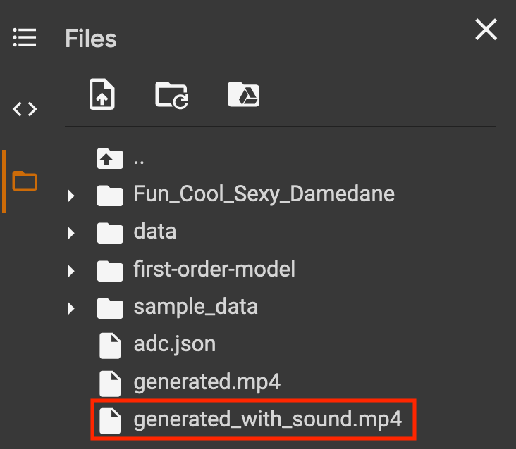

# Fun Cool and Sexy Damedane

## How to use it?

1. Simply run at Colab notebook: 
2. You will get mp4 file with sound like following:

3. Download from colab 

4. That's it!

If you want to make custom meme on your own, replace `fun_cool_sexy.png` with image file of your own, run on Google Colab notebook.

## Reference

* [First order model](https://github.com/AliaksandrSiarohin/first-order-model)
* [Damedanegenerator](https://github.com/Warhawk947/DameDaneGenerator)

